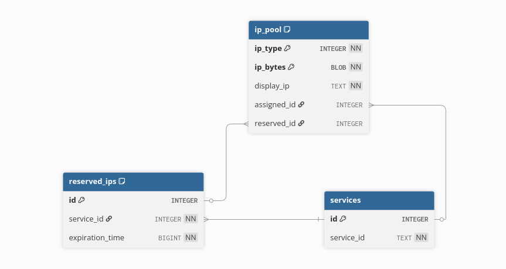
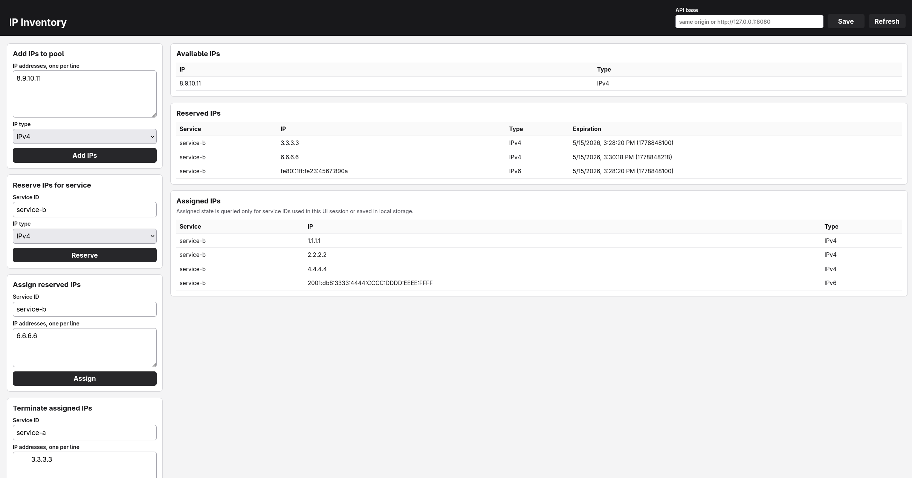

# IP Inventory

[](https://github.com/MartinNikolovMarinov/ip_inventory/actions/workflows/mac_cmake.yml)
[](https://github.com/MartinNikolovMarinov/ip_inventory/actions/workflows/ubuntu_cmake.yml)
[](https://github.com/MartinNikolovMarinov/ip_inventory/actions/workflows/windows_cmake.yml)
[](https://github.com/MartinNikolovMarinov/ip_inventory/actions/workflows/build_cmake.yml)

## Table of content

- [Overview](#overview)
- [Platforms](#platforms)
- [Building and running the Project](#building-and-running-the-project)
    - [Build](#build)
    - [Tests](#tests)
    - [Run](#run)
- [Folder Structure](#folder-structure)
- [Architecture](#architecture)
    - [Design Diagram](#design-diagram)
    - [Database schema](#database-schema)
- [Continues Integration](#continues-integration)
- [GUI](#gui)

## Overview

IP Inventory is a service for managing a shared pool of IPv4 and IPv6 addresses. It keeps track of which addresses are available, temporarily reserved, or permanently assigned to a service.

Clients use the API to add IP addresses to the pool, reserve addresses for a service, confirm a reservation by assigning the addresses, release assigned addresses, rename a service id, and query the current state of reservations or assignments. Reservations expire automatically if they are not assigned in time, so unused addresses return to the available pool.

The service exposes an HTTP/JSON API on `http://localhost:8080` by default. The current implementation stores data in SQLite, but persistence is behind a repository interface, so the same business logic can be used with another storage backend that implements the repository contract.

## Platforms

The project is designed for cross-platform and cross-architecture compatibility, supporting major desktop operating systems (Linux, macOS, Windows), compiler toolchains (GCC, Clang, MSVC), and CPU architectures (x86_64, ARM64).

Tested on:

1. Windows 11 x86_64
2. MacOS Tahoe (Version 26.5)
3. Ubuntu Linux x86_64

## Building and running the Project

The project does not have any runtime **dependencies**, but there are exactly 3 build **dependencies**:

* Git
* CMake - a version above or equal to `3.20.0` (released March 23, 2021)
* A Compiler capable of compiling C++ 20 code. MSVC, Clang and Gcc have been tested.

### Build

List available presets:

```sh
cmake --list-presets
```

Configure with one preset:

```sh
cmake --preset gcc-debug
cmake --preset gcc-release
cmake --preset clang-debug
cmake --preset clang-release
cmake --preset msvc-debug
cmake --preset msvc-release
```

Build:

```sh
cmake --build build --parallel

# For Windows MSVC it's required to pass the config option:
cmake --build build --config Debug --parallel
cmake --build build --config Release --parallel
```

### Tests

To run the tests:
```sh
ctest --test-dir build --output-on-failure

# For Windows MSVC it's required to pass the config option:
ctest --test-dir build -C Debug
ctest --test-dir build -C Release
```

### Run

To start the server:
```sh
./build/ip_inventory

# For Windows MSVC the executables are likely in a subfolder:
./build/Debug/ip_inventory.exe
./build/Release/ip_inventory.exe
```

The server listens on:

```text
http://localhost:8080
```

Swagger UI is available at:

```text
http://localhost:8080/docs/
```

**IMPORTANT:** The swagger endpoint is fully functional. Every listed api endpoint can be "executed" and tested.

## Folder Structure

```bash
├── CMakePresets.json # The available presets that have been tested.
├── CMakeLists.txt # The top-level cmake build configuration.
├──.github
│   ├── scripts # CMake scripts that run on CI/CD machines
│   └── workflows # CMake yml configurations that defined CI/CD Github Actions
├── api
│   ├── openapi.html # The index html that is served by the server on the /docs endpoint.
│   ├── openapi.yaml # The api definitions.
│   └── swagger-ui # The static javascript that creates the ui for Swagger.
├── build # The expected git ignored place for the build binaries.
├── cmake # Helper scripts used by the CMakeLists.txt for common CMake functionality.
├── db
│   └── ip_inventory.sqlite3 # This directory is used to store database objects locally.
├── include
│   ├── app.h
│   ├── compiler.h
│   ├── dtos.h
│   ├── handlers.h
│   ├── inventory # All source code related to the ip inventory service.
│   │   ├── inventory_types.h
│   │   ├── repository.h
│   │   ├── service.h
│   │   └── sqllite3_repository.h
│   ├── ip_utils.h
│   ├── profiling.h
│   ├── sqlite # Basic RAII abstraction layer over the sqlite driver.
│   │   └── sqlite.h
│   ├── str_utils.h
│   ├── types.h
│   └── validation.h
├── schema
│   └── 001_init_db.sql # This directory has the schema definition of the database.
├── scripts
├── src # Source files.
├── tests
│   ├── e2e # basic shell scripts to run e2e scenarios quickly and check server responses.
│   ├── ... # unit and integration tests.
│   └── unity # A very simplistic test framework.
└── vendor
    ├── cpp-httplib # git submodule for the http server support.
    ├── nlohmann # header only json parsing library.
    └── sqlite # sqlite driver.
```

## Architecture

The main goal of the project is to stay maximally cross-platform while remaining simple to build, test, and evaluate. The repository vendors the small third-party dependencies it needs and uses CMake presets so the same workflow can be used on Linux, macOS, and Windows with different compilers.

### Third party software usage reasons and research

Two important design decisions are the embedded HTTP server and the database backend.

For the HTTP server, several C++ options were evaluated:

1. `Boost.Beast` is the strongest production-oriented option, but Boost is a large dependency and would usually need to be installed as a system dependency. That made it too heavy for this project.
2. `Drogon` has similar concerns: it is production capable, but brings more dependency and build complexity than this project needs.
3. `oat++` is a good alternative, but its current development has been affected by the war in Ukraine.
4. `cpp-httplib` was selected because it is small, simple to vendor, easy to build, and enough for evaluating the service API.

**`cpp-httplib` also has important limitations**. It does not support HTTP/2, and it does not use scalable **asynchronous I/O** mechanisms such as `epoll`, `kqueue`, or Windows I/O completion ports. Its server model is **thread-per-connection**, which can be simple and acceptable for a small service, but becomes expensive under many concurrent clients because each connection consumes a thread stack and scheduling resources. The lack of async I/O is the bigger production concern for performance-sensitive systems because the server cannot efficiently multiplex large numbers of idle or slow connections.

For storage, full Relational Database Management Systems (`RDBMS`) such as PostgreSQL were considered, but they require system-level drivers such as `libpq`. SQLite was selected because it is easy to vendor, easy to initialize locally, relatively fast to build, and sufficient for this project. A production deployment should use a stronger relational database, so the application keeps persistence behind the `IpInventoryRepository` interface and the SQLite implementation can be replaced by another repository backend.

**Resulting third-party vendored dependencies:**
1. `vendor/cpp-httplib` - lite http server/client library.
2. `vendor/sqlite` - lite and portable sql database.
3. `vendor/nlohmann` - simple header only library for json parsing.
4. `tests/unity` - very lite unit testing framework.
5. `api/swagger-ui` - the distributed web application for displaying serving Swagger documentation.

### System Components

**App**

The `App` component owns the application lifecycle. It validates configuration, configures the HTTP routes, initializes repositories and services, starts the server, runs the reservation cleanup thread, and coordinates shutdown.

**Handlers**

The handlers layer is the entry point for request-specific logic. Handlers receive the raw HTTP request/response objects, parse JSON into DTOs, validate the request shape, convert API objects into domain objects, and then call the IP inventory service. They also translate service results back into JSON responses.

**IP Utils**

The `ip_utils` module is a critical part of the domain model. It uses `inet_pton` to parse and validate incoming IP addresses into binary form. This avoids treating equivalent textual forms as different addresses, for example `2001:db8::1` and `2001:0db8:0:0:0:0:0:1`. If IP identity were based only on strings, the same address could be assigned to different services, which would be a serious correctness bug.

For that reason the project models IP addresses like this:

```c++
struct IpAddress {
    std::string str;
    u8 bytes[16] {};
    IpType type = IpType::IPv4;
};
```

The identity of an IP address is defined by `type` and `bytes`; `str` is only the display representation. This is the most important design decision in the project because all reservation and assignment correctness depends on canonical IP identity.

**Services**

The service layer applies business-level validation and coordinates inventory operations. It does not know about SQLite directly; it depends on the abstract `IpInventoryRepository` interface, which keeps the business logic separate from the storage implementation.

**Repositories**

The repository implementation performs the database CRUD operations and keeps related changes inside transactions. This is important for operations such as reserving or assigning multiple addresses, where the database should not be left in a partially updated state.

**Database**

The database schema has the expected `services` and `ip_pool` tables, plus a separate `reserved_ips` table. Reservations are separated so expiration cleanup can scan and delete the **smallest set of rows** instead of repeatedly inspecting the whole IP pool. Since garbage collection runs periodically, this keeps cleanup simple and efficient.

If reservation traffic becomes heavier, an in-memory cache for reserved IPs could be added in the service layer without changing the repository contract.

### Design Diagram


### Database schema



The schema stores service ids separately from the IP pool and reservation rows, so pool entries can point either to an assigned service or to a temporary reservation. IP addresses use `(ip_type, ip_bytes)` as the primary key: the type distinguishes IPv4 from IPv6, and the binary bytes provide a canonical value independent of display formatting.

Indexes are created on `ip_pool.assigned_id`, `ip_pool.reserved_id`, and `reserved_ips.expiration_time`. They support the common assignment/reservation lookups and make reservation cleanup efficient when expired rows are removed.

## Continues Integration

The project uses GitHub Actions to run the same CMake configure, build, and test flow that is used locally. The workflows are triggered manually with `workflow_dispatch` so CI minutes are not spent on every commit while this is a personal project. For a production project, the same checks would normally run on pull requests, commits to `master`, and still remain available as manual runs.

There are separate workflows for Ubuntu, macOS, and Windows, plus a combined build matrix. Together they exercise the project across the main supported platform and compiler combinations: Linux with GCC and Clang, macOS with Clang, and Windows with MSVC. The workflows build both Debug and Release presets and run the test suite after each build.

This gives coverage across the main operating systems, compiler toolchains, and runner architectures used by the project, including x86 and ARM64 environments where they are available from GitHub-hosted runners.

## GUI

There is a basic single page pure js/css/html GUI application designed to test the Ip Inventory REST service quickly.

Open `http://localhost:8080/gui` in the browser after starting the server, here is a screenshot:

