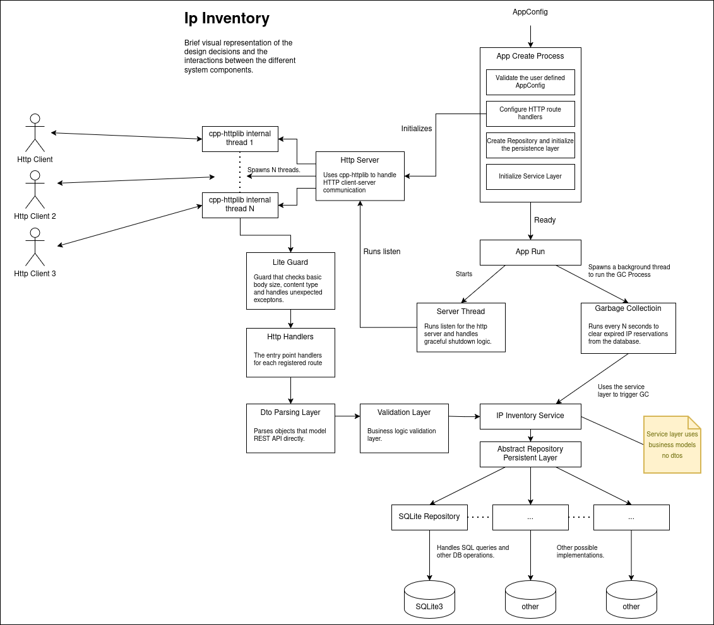

# IP Inventory

[](https://github.com/MartinNikolovMarinov/ip_inventory/actions/workflows/mac_cmake.yml)
[](https://github.com/MartinNikolovMarinov/ip_inventory/actions/workflows/ubuntu_cmake.yml)
[](https://github.com/MartinNikolovMarinov/ip_inventory/actions/workflows/windows_cmake.yml)
[](https://github.com/MartinNikolovMarinov/ip_inventory/actions/workflows/build_cmake.yml)

## Table of content

- [Overview](#overview)
- [Building and running the Project](#building-and-running-the-project)
    - [Build](#build)
    - [Tests](#tests)
    - [Run](#run)
- [Architecture](#architecture)

## Overview


## Building and running the Project

The project does not have any runtime **dependencies**, but there are exactly 3 build **dependencies**:

* Git
* CMake - a version above or equal to `3.20.0` (released March 23, 2021)
* A Compiler capable of compiling C++ 20 code. MSVC, Clang and Gcc have been tested.

### Build

List available presets:

```sh
cmake --list-presets
```

Configure with one preset:

```sh
cmake --preset gcc-debug
cmake --preset gcc-release
cmake --preset clang-debug
cmake --preset clang-release
cmake --preset msvc-debug
cmake --preset msvc-release
```

Build:

```sh
cmake --build build --parallel

# For Windows MSVC it's required to pass the config option:
cmake --build build --config Debug --parallel
cmake --build build --config Release --parallel
```

### Tests

To run the tests:
```sh
ctest --test-dir build --output-on-failure

# For Windows MSVC it's required to pass the config option:
ctest --test-dir build -C Debug
ctest --test-dir build -C Release
```

### Run

To start the server:
```sh
./build/ip_inventory

# For Windows MSVC the executables are likely in a subfolder:
./build/Debug/ip_inventory.exe
./build/Release/ip_inventory.exe
```

The server listens on:

```text
http://localhost:8080
```

Swagger UI is available at:

```text
http://localhost:8080/docs/
```

## Architecture

Design Diagram:

